# Jyothir

**writes code · reads docs · caffeinates in between · mildly sarcastic**

<table>
  <tr>
    <td valign="top"></td>
    <td valign="top"></td>
  </tr>
</table>

  

Graph updates daily via GitHub Actions — no auth, just scraped from my public profile.

